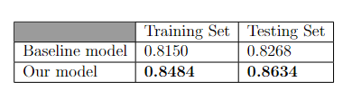
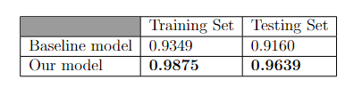
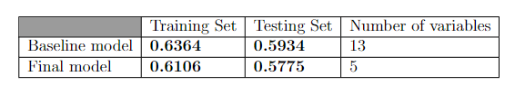

# STAT452-Final
Applied Statistics for Engineers and Scientists II Final Project on Linear Regression
Authors:
- Luu Quoc Bao - 22125008
- Le Minh Hoang - 22125029
- Le Duc Nhuan - 22125070
- Dang Minh Nhut - 22125071

The project includes two activities:
- Activity 1 (4 points): Analyze a dataset on vehicle fuel consumption (`auto_mpg.csv`). 
- Activity 2 (6 points): Find two datasets, clean and analyze them, and perform regression analysis on one quantitative variable.

You can find more details in the [`FinalProject_2024.pdf`](FinalProject_2024.pdf) file.
## Task 1
Data set: `auto_mpg.csv` (given by instructor)

In this task, the data was preprocessed by removing the "car name" column, handling missing values, converting "horsepower" to numeric, and changing "origin" to a factor. The data was split into training and testing sets, and a baseline linear regression model was fitted to predict "mpg" using all original variables.

To improve the model, log transformations of "horsepower," "displacement," and "weight" were applied, along with interaction terms and a quadratic transformation of "model year." The improved model showed a higher R-squared value compared to the baseline, indicating better predictive performance.

Despite some issues with non-normal residuals and heteroscedasticity, the new model's residuals were acceptable in the middle range, with no autocorrelation. Testing on the test set confirmed its superior performance over the baseline model.

## Task 2
### Task 2.1 - Fish market
Data set: `Fish.csv` (from [kaggle](https://www.kaggle.com/datasets/vipullrathod/fish-market))

In this task, the data was preprocessed by combining the "Length" column and converting "Species" to a factor. After splitting the data into training and testing sets, a baseline linear regression model was fitted to predict "Weight."

To improve the model, insights from scatter plots led to the inclusion of a full quadratic model for "Length," "Height," and "Width," along with dummy variables for "Species." A backward stepwise selection was used to keep significant variables.

Though neither model had ideal residuals, the second model's residuals were acceptable in the middle range, with no autocorrelation. Testing on the quadratic model showed a higher R-squared value compared to the baseline, confirmed by an ANOVA test.

### Task 2.2 - Body fat
Data set: `bodyfat.csv` (from [kaggle](https://www.kaggle.com/datasets/fedesoriano/body-fat-prediction-dataset))

In this task, we first preprocessed the data by removing the ”Density” column and adding 2 dummy
variables for the ”BMI” column. We then split the data into training and testing sets. We fitted a
baseline linear regression model with all original variables to predict ”BodyFat” and then reduced
it based on its summary model.

According to the ”Model diagnostics for baseline model” section and the ”Model diagnostics for
final model” section, the baseline model and the final model is ideal as the residuals are normally
distributed and homoscedastic, there is no autocorrelation in the residuals, and R squared is not
bad.

Finally, we test the baseline model and the final model on the test set and find that the R-squared
values on the test set is not as high as the R-squared value on the training set but it does not
deviate too much.